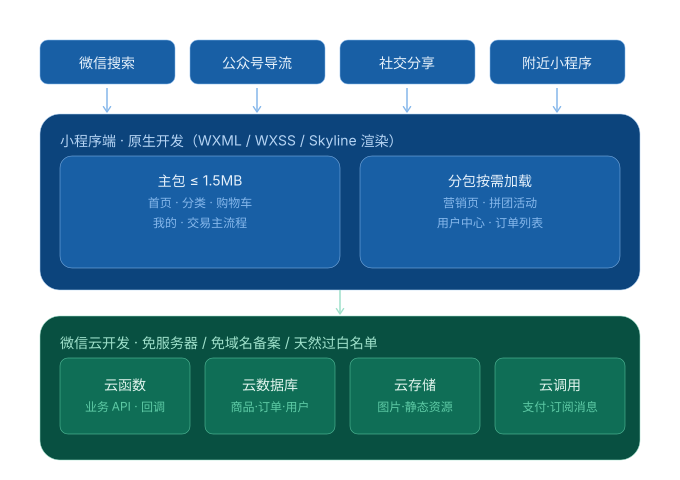
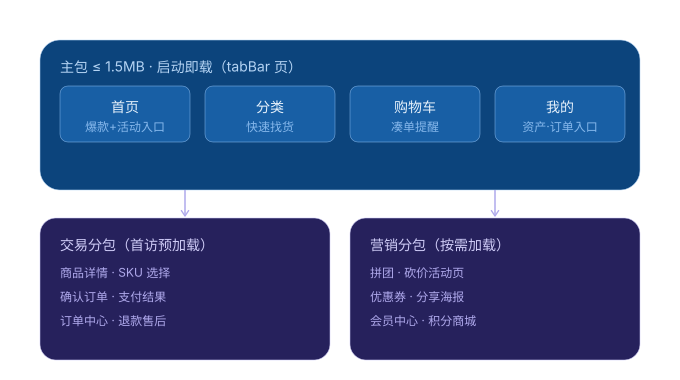
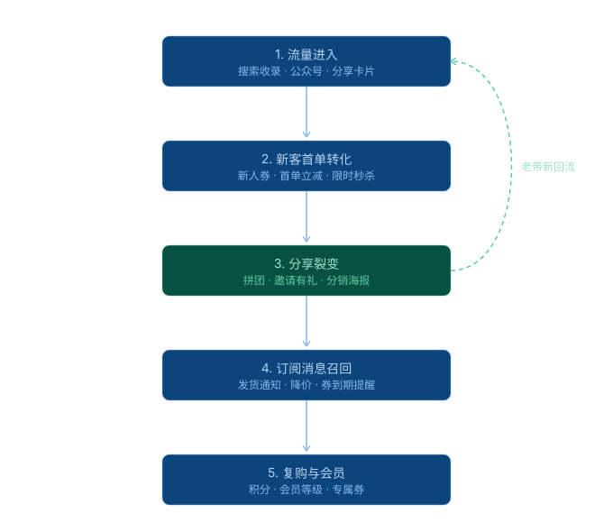

# WorkBuddy 会话归档 · 2026-09-16

本次对话的完整记录与交付物归档。主题：电商小程序架构设计 → 液态玻璃按钮双端复刻 → 会话上传 GitHub。

| 项 | 内容 |
|---|---|
| 日期 | 2026-09-16 |
| 专家角色 | 微信小程序开发工程师 |
| 目录 | `docs/对话记录.md` 完整对话；`deliverables/` 全部产出代码与文档 |
| 技术栈 | 微信小程序（原生 + 云开发）、Flutter、GitHub REST API |

---

## 一、电商小程序架构设计

需求：**快速上线 + 快速获客**。经澄清确认：电商零售、原生小程序、微信云开发、四类增长能力全要。

### 总体架构



四层：流量入口（搜索 / 公众号 / 分享 / 附近小程序）→ 小程序端（主包 + 分包）→ 微信云开发（云函数 / 云数据库 / 云存储 / 云调用）。

### 页面结构与分包策略



主包只放 tabBar 四页（≤1.5MB），交易分包用 `preloadRule` 预加载，营销分包按需加载。

### 用户增长闭环



---

## 二、液态玻璃按钮（Flutter + 小程序）

复刻自 [CarGuo/gsy_flutter_demo](https://github.com/CarGuo/gsy_flutter_demo) 的毛玻璃按钮，并叠加液态高光动效。

> 注意：原链接 `lib/widget/liquid_glass_demo.dart` 是 404，真实路径为 `lib/widget/canvas/liquid_glass_demo.dart`，且该文件是全屏液态玻璃着色器（无按钮）；按钮在同目录 `glass_demo_page.dart` 的 `_buildGlassButton`。

- Flutter 组件：`deliverables/liquid-glass-button/flutter/`
- 小程序组件：`deliverables/liquid-glass-button/miniprogram/components/liquid-glass-button/`
- 浏览器预览：`deliverables/liquid-glass-button/preview.html`
- 接入文档：`deliverables/liquid-glass-button/README.md`

---

## 三、本次会话归档

`docs/对话记录.md` 为完整对话（含每一轮的需求澄清与结论），`tools/upload-to-github.ps1` 是本仓库的上传脚本（通过 GitHub REST API，便于在受限网络环境使用）。

## 目录结构

```
.
├── README.md                 # 本文件
├── docs/
│   ├── 对话记录.md            # 完整对话记录
│   └── diagrams/             # 三张架构图（SVG）
└── deliverables/
    ├── 小程序架构设计-电商云开发版.md
    └── liquid-glass-button/  # 双端组件 + 预览页 + 接入文档
```
